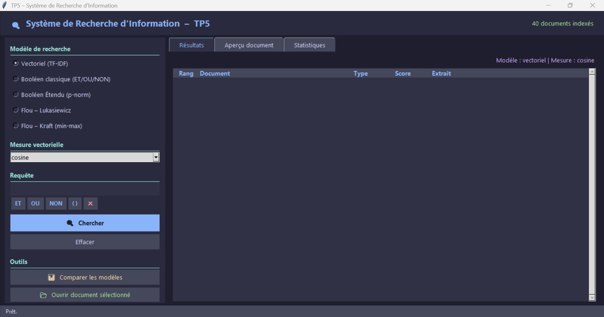

# TP5 – Mini Projet : Système de Recherche d'Information (SRI)

**Matière :** Technique d'indexation et recherche multimédia  
**Filière :** Génie Logiciel – 2ème niveau

---



## Structure du projet

```
TP5_MINI_PROJET/
├── main.py                  # Point d'entrée
├── index_util.py            # Index inversé + TF-IDF (multi-format)
├── recherche.py             # Moteur de recherche (5 modèles)
├── interface.py             # Interface graphique Tkinter
├── generate_docs.py         # Générateur de collection (40+ docs)
├── rapport.py               # Générateur du rapport PDF
├── requirements.txt
├── README.md
│
├── utils/
│   ├── etape1_pdf.py        # Extraction texte : PDF, TXT, HTML, DOCX
│   ├── etape2_stopwords.py  # Suppression mots vides (FR + EN)
│   ├── etape3_stemming.py   # Stemming (PorterStemmer)
│   ├── etape4_tf.py         # Calcul TF
│   ├── etape5_idf.py        # Calcul IDF
│   └── etape6_tfidf.py      # Calcul TF-IDF
│
├── modeles/
│   └── __init__.py          # Tous les modèles :
│                            #   ModeleVectoriel (6 mesures)
│                            #   ModeleEtendu (p-norm)
│                            #   ModeleLukasiewicz
│                            #   ModeleKraft
│
├── operateurs/
│   └── __init__.py          # et(), ou(), non()
│
└── documents/               # Collection (40+ docs)
    ├── pdf/                 # 20 fichiers PDF
    ├── txt/                 # 10 fichiers TXT
    ├── html/                # 5 fichiers HTML
    └── docx/                # 5 fichiers DOCX
```

---

## Installation

```bash
pip install PyPDF2 nltk reportlab python-docx
python -m nltk.downloader stopwords punkt
```

## Génération de la collection (40+ documents)

```bash
python generate_docs.py       # génère TXT, HTML, DOCX
# Pour les PDF, utilisez generate_docs_pdf.py (nécessite reportlab)
```

## Lancement

```bash
python main.py                # Démarre l'interface
python main.py --reindex      # Force la réindexation
python main.py --dossier /chemin/vers/docs
```

---

## Modèles de recherche

| Catégorie | Modèle | Description |
|-----------|--------|-------------|
| Booléen | Classique | ET / OU / NON ensemblistes |
| Booléen | Étendu (p-norm, p=2) | Score continu basé sur p-norm |
| Flou | Lukasiewicz | AND=∏wᵢ, OR=min(1, Σwᵢ) |
| Flou | Kraft (min-max) | AND=min(wᵢ), OR=max(wᵢ) |
| Vectoriel | **Cosinus** | sim = (q·d)/(‖q‖×‖d‖) |
| Vectoriel | **Dice** | 2(q·d)/(‖q‖²+‖d‖²) |
| Vectoriel | **Jaccard** | (q·d)/(‖q‖²+‖d‖²−q·d) |
| Vectoriel | **Overlap** | (q·d)/min(‖q‖²,‖d‖²) |
| Vectoriel | **Euclidienne** | 1/(1+dist(q,d)) |
| Vectoriel | **Produit scalaire** | q·d |

---

## Fonctionnalités de l'interface

- **Sélection du modèle** et de la **mesure vectorielle**
- **Opérateurs booléens** intégrés (boutons ET / OU / NON)
- **Résultats** avec rang, type de fichier, score et extrait contextuel
- **Extrait contextuel** : 2 lignes du document contenant les termes
- **Ouverture directe** du document depuis l'interface
- **Comparaison côte-à-côte** des 4 modèles
- **Historique** des requêtes (double-clic pour relancer)
- **Statistiques** de l'index (Top 20 termes, densité, répartition par type)
- **Réindexation** à la volée

---

## Analyse comparative des modèles

Sur la requête **"machine learning"** (collection 20 PDF) :

| Modèle | Doc #1 (score) | Nb résultats | Observation |
|--------|----------------|--------------|-------------|
| Vectoriel Cosine | doc_01 (0.684) | 4 | Meilleur classement |
| Vectoriel Dice | doc_01 (0.261) | 4 | Scores plus faibles |
| Jaccard | doc_01 (0.150) | 4 | Plus sélectif |
| Étendu | doc_01 (0.139) | 4 | Scores resserrés |
| Lukasiewicz | doc_01 (0.011) | 4 | Scores très faibles |
| Kraft | doc_01 (0.137) | 4 | Stable, similaire à Étendu |
| Booléen | doc_01 (✓) | 2+ | Exact, sans nuance |

**Conclusion :** La similarité cosinus offre le meilleur classement. Dice et Jaccard sont plus sélectifs. Lukasiewicz génère des scores très proches de zéro pour les requêtes multi-termes (effet produit). Le modèle Kraft est plus stable.
